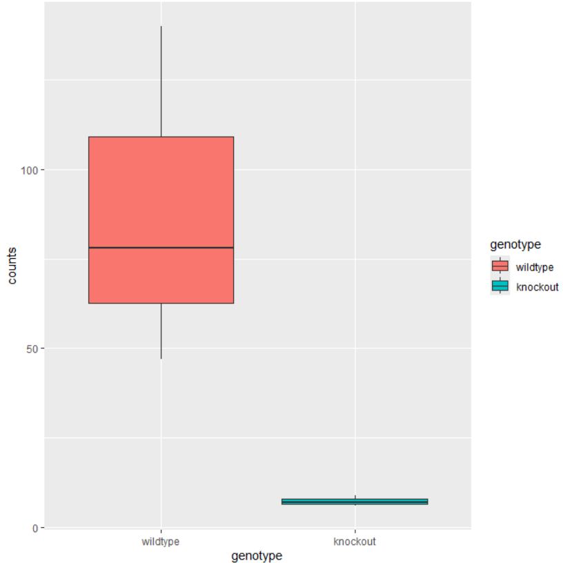
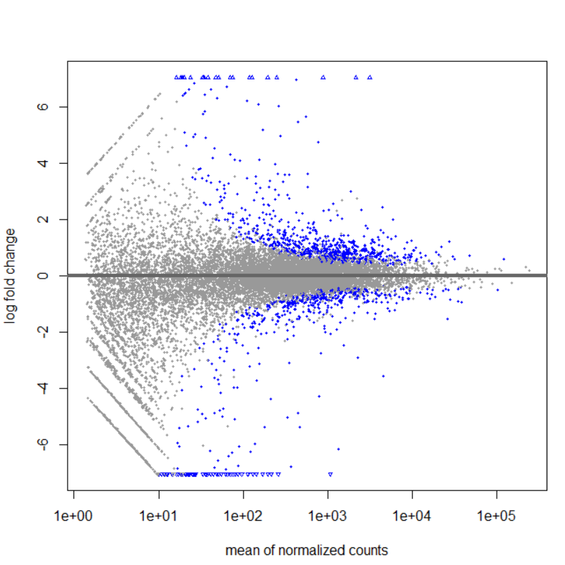
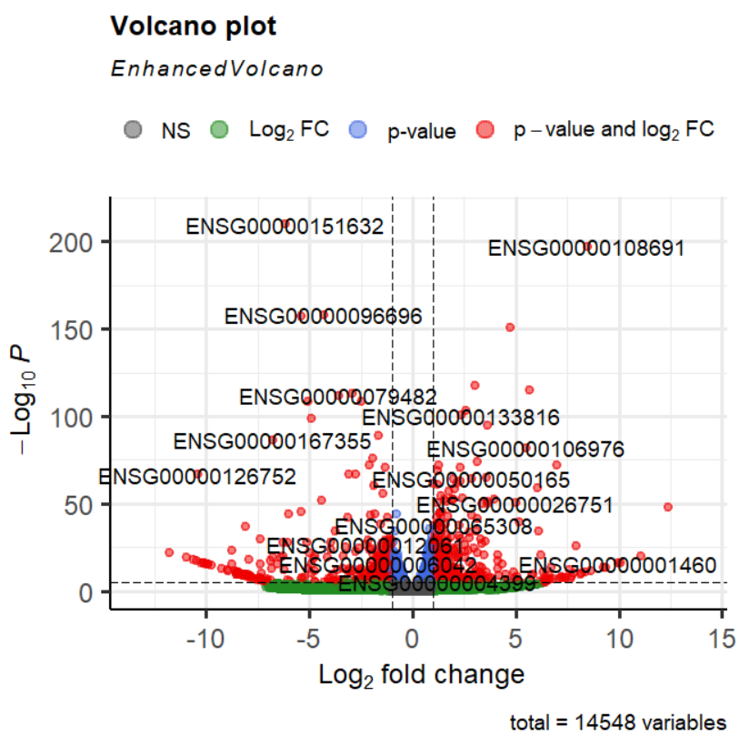
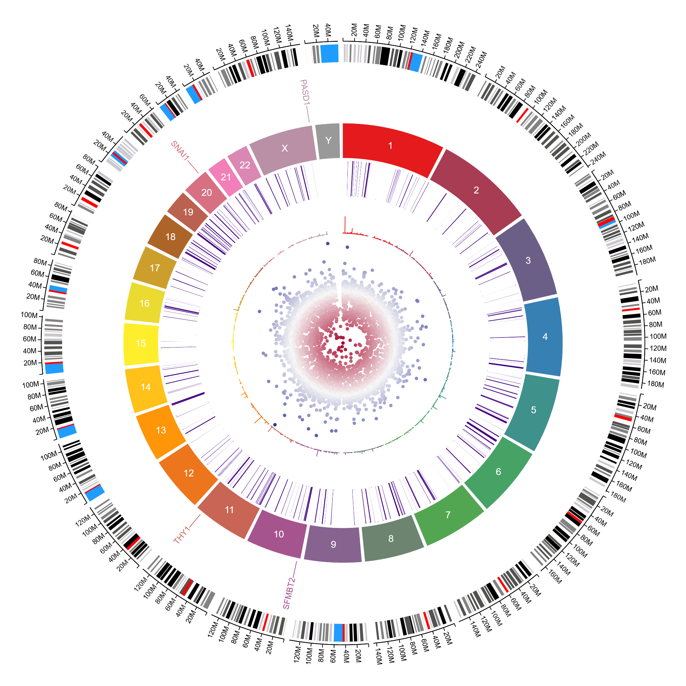

# RNA-Seq-differential-expression-tutorial-with-DESeq2
Rstudio- differential expression

# Preprocessing (Wrangle data for DESeq2 & Spot check expression for knockout gene SNAI1)

# Run DESeq

# Spot checks

# Visualization

